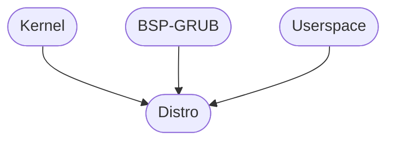

# Arctan-OS/Distro

## What
This is a repository which contains everything required to build an operating system which
uses Arctan-OS/Kernel and an Arctan compatible bootstrapper.

## Components


Note: `MB2BSP` can be replaced by any bootstrapper.

## Requirements
* See the requirements for the bootstrapper you are building with.
* Packages to build Binutils
* Packages to build GCC
* gcc
* binutils
* xorriso
* nasm
* make
* gzip
* cpio
* qemu (for `make run`)
* curl
* bear (to generate compile_commands.json)

## Build Instructions
Please note that the kernel and desired bootstrapper will be cloned to the Distro's
parent directory. If you wish to separate Arctan projects, ensure that Distro is contained
within its own "Arctan" directory.

The distrobution can be built with a command of the following form:

```shell
$ make BSP=<bsp> all
```

Where `<bsp>` is replaced with the shortened version of the bootstrapper to use.
For instance, if one were to build using the GRUB Multiboot2 bootstrapper, `<bsp>` would
be substituted by `GRUB`.

This will build the host and build toolchains if needed. On each call, the kernel and
bootstrapper directories will be cleaned in order to pull in any changes you have made.

Other fields are
`SCHED=RR` - to specify the scheduler to be a round robin
`DEBUG=yes` - to enable debug logs
`COM=0x3F8` - to send all print messages through COM1 (see [other COM addresses](https://osdev.wiki/wiki/Serial_Ports#Port_Addresses))

The resultant ISO file can be started using `qemu-system-x86_64` using the following
command:

```shell
$ make run
```

### List of Bootstrapper Codes
* `GRUB` - Multiboot2 Bootstrapper
* `LBP` - Limine Bootstrapper

### List of Scheduler Codes
* `MLFQ` - Multi-level Feedback Queue (DEFAULT)
* `RR` - Round Robin

## Directory Layout

The build system is organized into the following inital directories:
* build-support
* initramfs-constant
* toolchain-build
* toolchain-host

And the following runtime directories:
* sysroot
* initramfs
* volatile

NOTE: A program's build machine is the machine on which it is compiled (or built), the host machine
is the one on which the program is run.

### build-support

The build-support subdirectory contains files which aid in building the final disk image. These
may contain files used in the building of the build toolchain, host toolchain, kernel, and bootstrapper.

### initramfs

On each build, this directory is copied into sysroot, which is then made into a .cpio image. The original directory
is kept, as it contains the toolchain to build the system, and the rest of the files on the system.

### toolchain-build

This directory is responsible for building all tools needed by the build machine to compile for the host machine. The 
resultant files will be installed in sysroot.

### toolchain-host

This directory is responsible for building all tools needed by the host machine. Resultant files will be installed in sysroot.

### sysroot 

The system root for the host machine.

### volatile

This contains files and directories that are subject to change with builds. For instance kernel.elf, initramfs.cpio, and
live_env.cpio.

NOTE: It is the responsibility of the bootstrapper to construct the final product, defined by \$(ARC_PRODUCT),
and to appropriately install the kernel executable, located at \$(ARC_ROOT)/volatile/kernel.elf, initramfs,
located at \$(ARC_ROOT)/initramfs.cpio, and live environment, located at \$(ARC_ROOT)/live_env.cpio into this final product.
